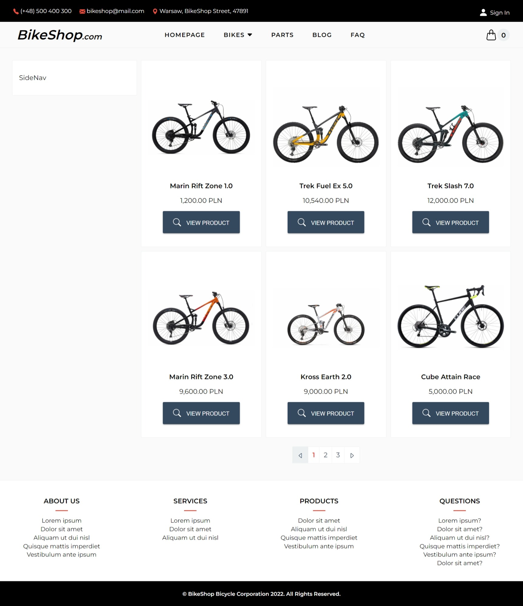
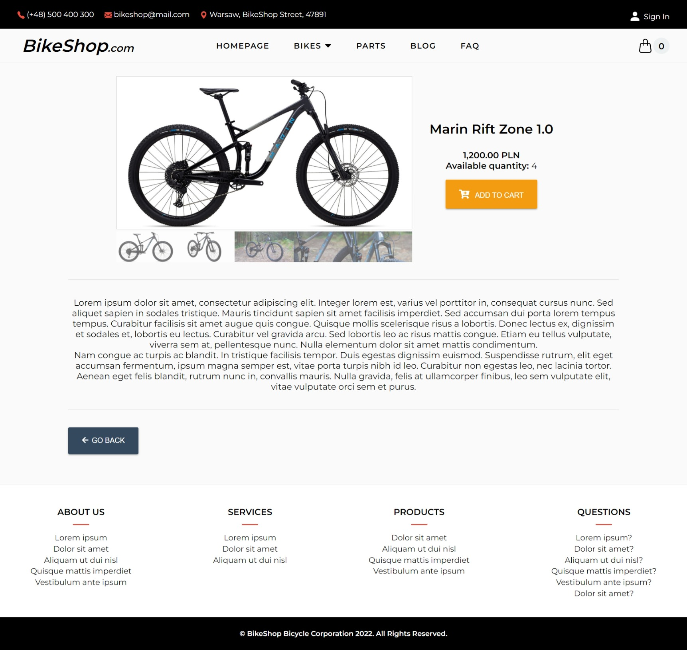
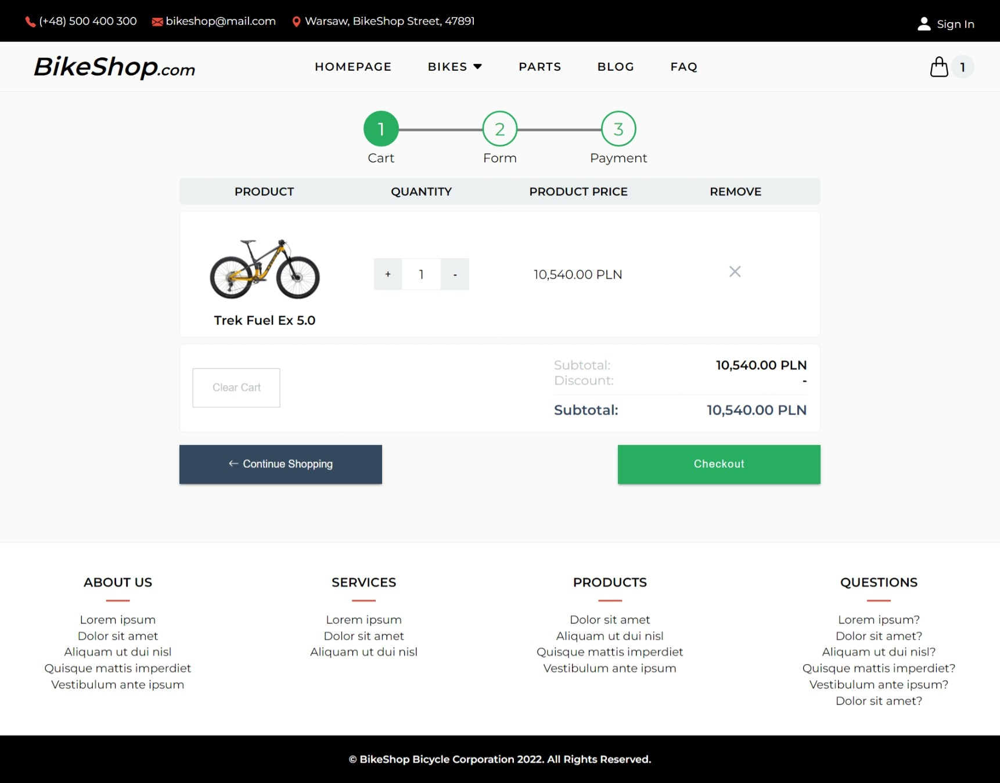
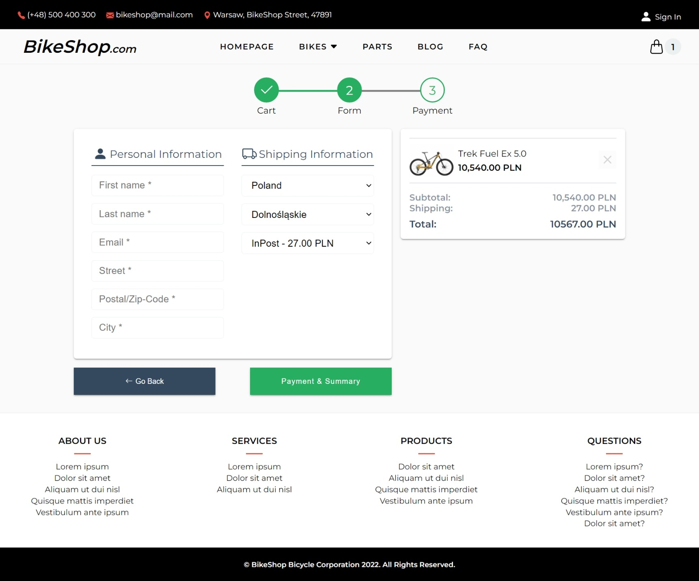

Simple ecommerce written with Next.js and Commerce.js, it also uses Stripe for making payments.

## Getting Started

First, install dependencies with:

```bash
npm install
# or
yarn install
```

Secondly, run the development server:

```bash
npm run dev
# or
yarn dev
```

## Live Link
https://sad-hopper-35f9b5.netlify.app


## Screenshots





